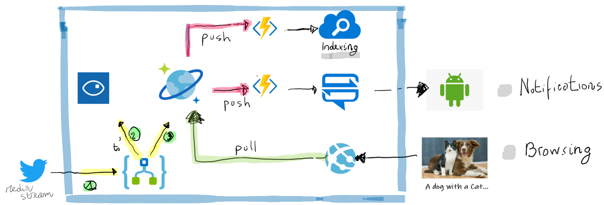

# Cognitive Services Lab
This is a hands on lab guide for Azure. In this lab you will deploy a serverless application which uses Azure Cognitive Services to analyze photos gathered from twitter. An Azure Logic App drives the process and carries out most of the tasks. 

The Logic App flow is:
- Calls the Twitter API and searches for tweets containing a certain hashtag
- Calls the Azure cognitive service API for each photo and gets the result which is a description of the contents of the photo
- Stores the result in Azure Cosmos DB
This is a hands on lab guide for Azure. In this lab you will deploy a serverless application which uses Azure Cognitive Services to analyze photos gathered from twitter. An Azure Logic App drives the process and carries out most of the tasks.

The Logic App flow is:

Calls the Twitter API and searches for tweets containing a certain hashtag
Calls the Azure cognitive service API for each photo and gets the result which is a description of the contents of the photo
Stores the result in Azure Cosmos DB
The Azure cognitive service uses a pre-trained computer vision model to return results describing the image as a JSON object. Cosmos DB is a No-SQL database, which the Logic App uses to store the results as JSON documents, one for each photo result.

The data from Cosmos is then consumed by three consumers, in push and poll mode. Specifically:

PUSH: Azure Search is a cognitive service to index documents. It works in push and pull mode. In this lab we will show both
PUSH: Notification Hub is an Azure Service that captures notifications to send to mobile apps
PULL: A simple web app, written in Node.js. This web app is hosted in Azure as an Web App Service, it connects to Cosmos DB and displays the photo analysis results as a simple web page.
The guide steps through deploying and configuring the complete end to end solution in Azure.
# Solution Architecture

